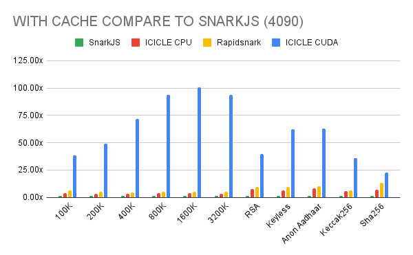
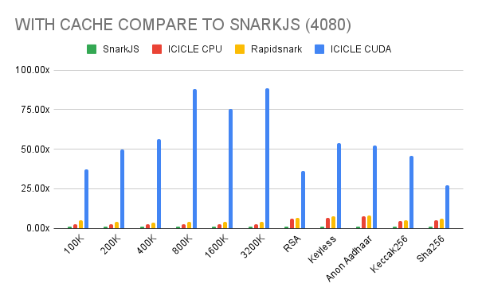
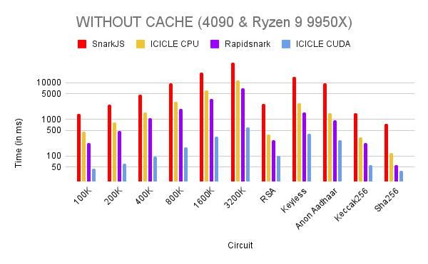
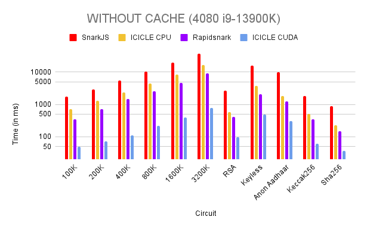
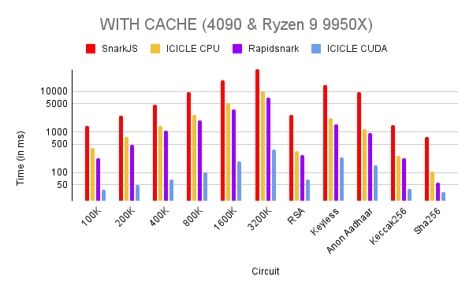
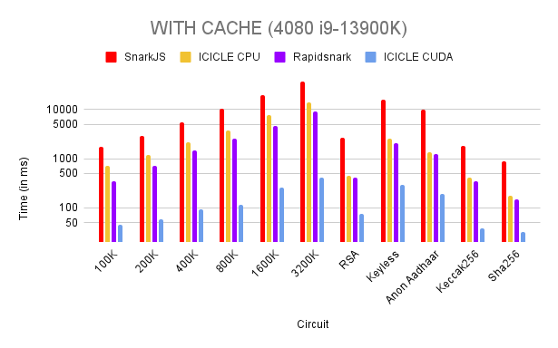

# Icicle Snark Installation and Usage Guide

## Overview

The Icicle Snark implementation in this repository provides efficient proof generation using both **CUDA**, **CPU** backends. This guide covers installation, execution, and integration into your own Rust or other projects.

For a deeper dive into performance benchmarks and optimizations, check out our blog post: [ICICLE-Snark: The Fastest Groth16 Implementation in the World](https://medium.com/@ingonyama/icicle-snark-the-fastest-groth16-implementation-in-the-world-00901b39a21f)

---

## Building CUDA Backend

### 1. Build

```bash
cd icicle/
cmake -DCMAKE_BUILD_TYPE=Release -DCURVE=bn254 -DCUDA_BACKEND=local -S . -B build
cmake --build build -j
```

### 2. Set the Installation Path

- Define the environment variable `ICICLE_BACKEND_INSTALL_DIR` to point to the backend build directory:

```bash
export ICICLE_BACKEND_INSTALL_DIR=path/icicle/build/backend
```

---

## Running Icicle-Snark in Worker Mode

To execute a proof, specify the paths for the witness file, zkey file, and output paths for the proof and public JSONs.

### Example Usage

```bash
cargo run --release
```

```bash
prove --witness ./witness.wtns --zkey ./circuit.zkey --proof ./proof.json --public ./public.json --device CUDA
prove --witness ./witness.wtns --zkey ./circuit.zkey --proof ./proof.json --public ./public.json --device CPU
```

---

## Integrating with Rust Projects

You can integrate Icicle Snark into your Rust project using the provided `icicle_snark` library.

### First add it as dependency

```bash
cargo add icicle-snark
```

or add the following to your Cargo.toml

```toml
[dependencies]
icicle-snark = { git = "https://github.com/ingonyama-zk/icicle-snark" }
```

### Then you can use it directly in your code

```rust
use icicle_snark::{groth16_prove, CacheManager};

fn main() {
    let mut cache_manager = CacheManager::default();

    let witness = "./witness.wtns";
    let zkey = "./circuit_final.zkey";
    let proof = "./proof.json";
    let public = "./public.json";
    let device = "CUDA"; //CPU

    for _ in 0..10 {
        groth16_prove(witness, zkey, proof, public, device, &mut cache_manager).unwrap();
    }   
}
```

---

## Integrating with other codebases

Navigate to examples/python folder to see example usage

## Benchmarks

We benched the code on 2 different setups:

- 4080 & i9–13900K
- 4090 & Ryzen 9 9950X

We used the circuits in the MoPro’s benchmark repository to compare the proving systems.

- **Complex Circuits**: These circuits are for pure benchmarking purposes. It allows us to compare the performance of the provers based on a number of constraints.
- **Anon Aadhaar**: Anon Aadhaar is a zero-knowledge protocol that allows Aadhaar ID owners to prove their identity in a privacy preserving way.
- **Aptos Keyless**: Aptos Keyless lets users create self-custodial Aptos accounts with OIDC credentials (e.g., Google, Apple) instead of secret keys or mnemonics.

In production it’s more likely that a project is going to prove the same circuits. To utilize this we are using the Cache system. However the other tools we compare are CLI so they terminate after one proving. To keep things fair we provide both benchmarks with and without cache.

<p align="center">
  
  
</p>

<p align="center">
  
  
</p>

<p align="center">
  
  
</p>

## Reproducing the benchmarks

We have provided some sample circuits under benchmark folder. However to run the prover you need to generate .zkey and .wtns files. You can use snarkjs to do that. We have prepared a `setup.sh` script that generates the witness and zkey files for testing purposes only. You can execute this script inside the circuit folder you want to test.

### Setup

```bash
cd benchmark/path
source ../../scripts/setup.sh
```

## Disclaimer

This software has not been audited and should not be used in production environments. Use at your own risk.
